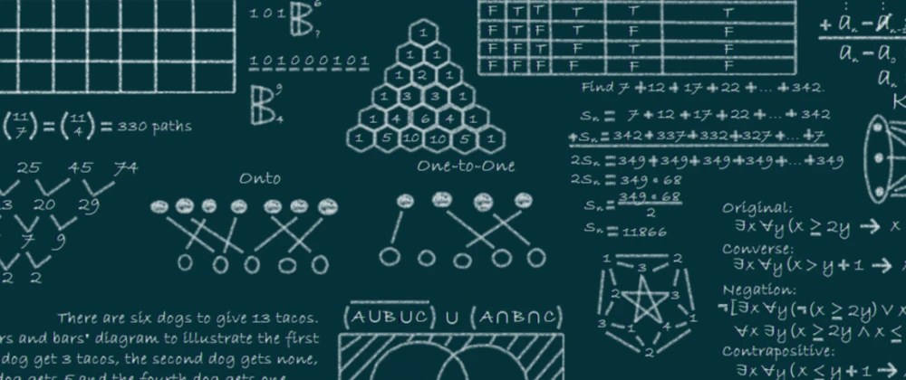

# Data Structures

A data structure is a particular way of organising data in a computer so that it can be used effectively.

Data structures enable us to:

- Manage and utilise large datasets
- Search for particular data from a database
- Design algorithms that are tailored towards particular programs
- Handle multiple requests from users at once
- Simplify and speed up data processing.

## Types of Data Structures

- Linear Data Structures

  - Arrays
  - Linked List
  - Doubly-Linked List
  - Stack
  - Queue

- Trees

  - Binary Tree
  - Binary Search Tree
  - Heap
  - Hash Tables

- Graphs

  - Graph
  - Tries
  - Segment Tree
  - Suffix Tree
